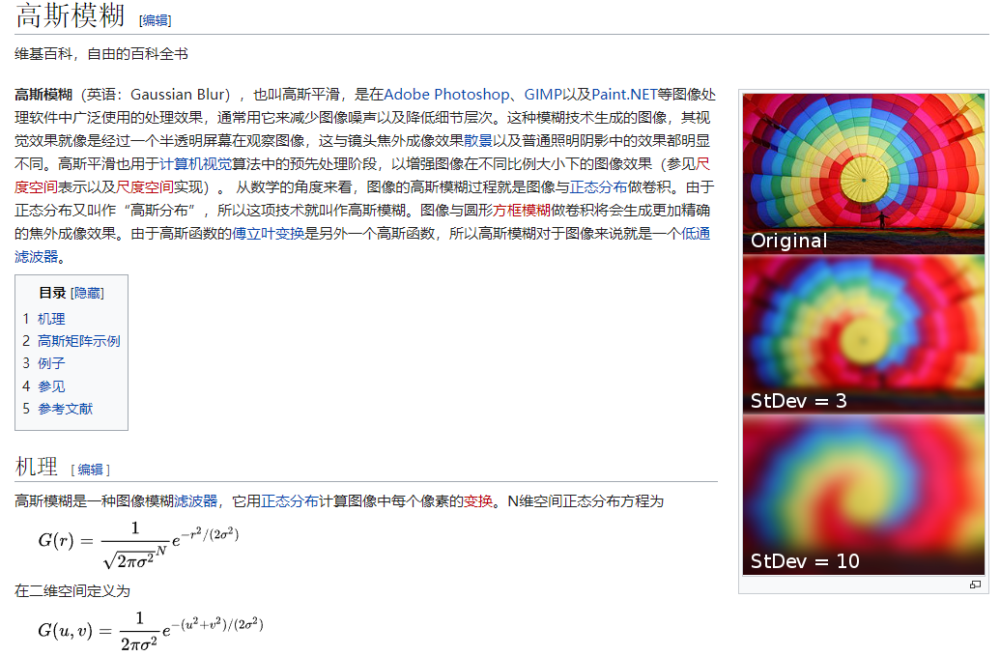
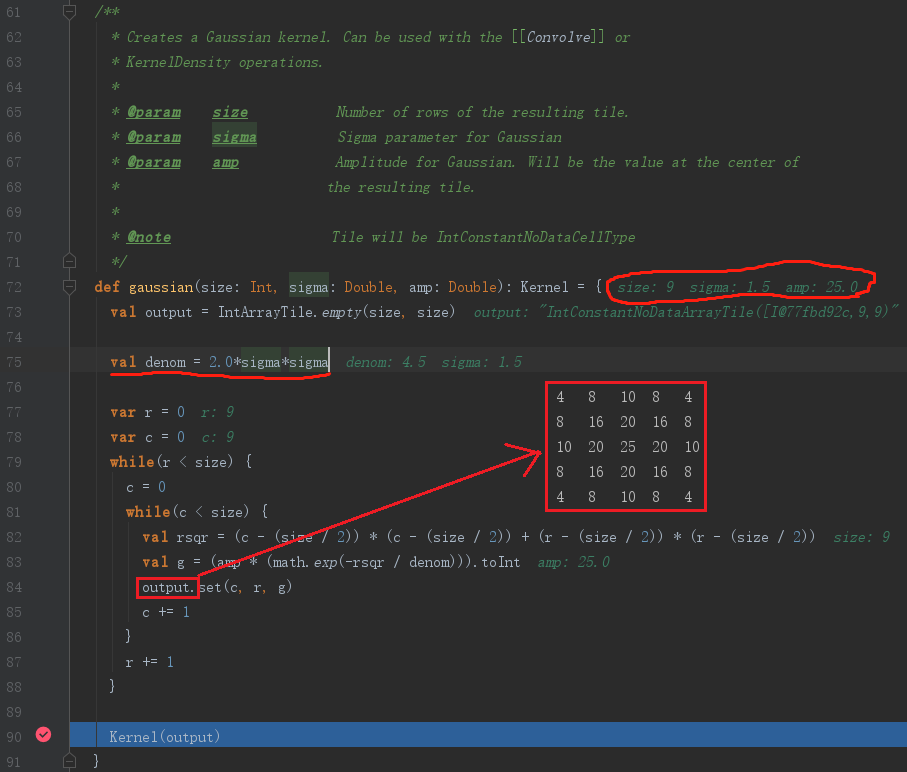
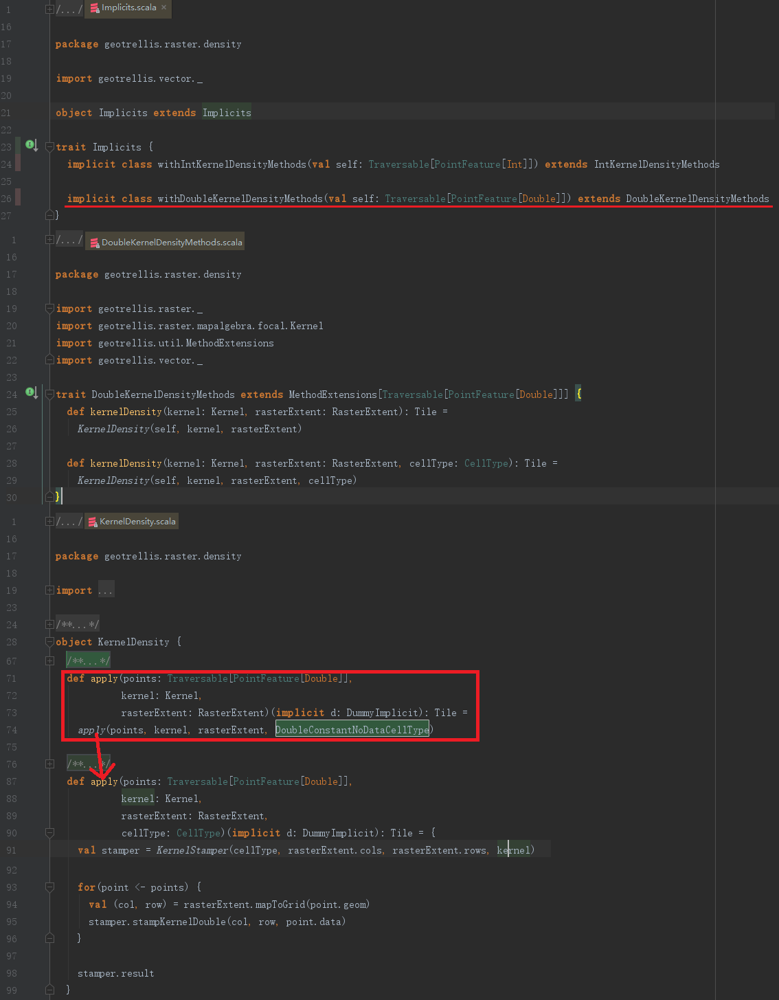
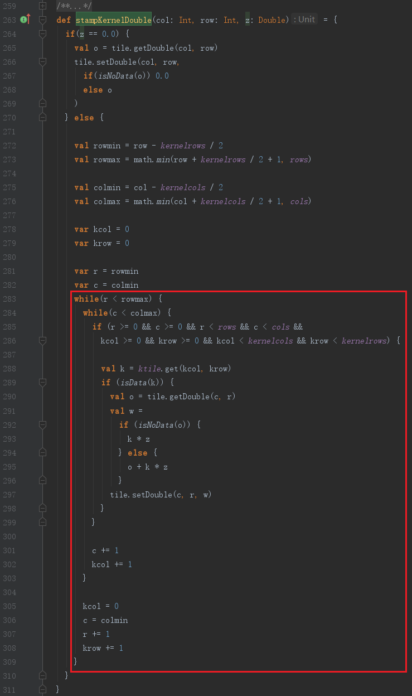
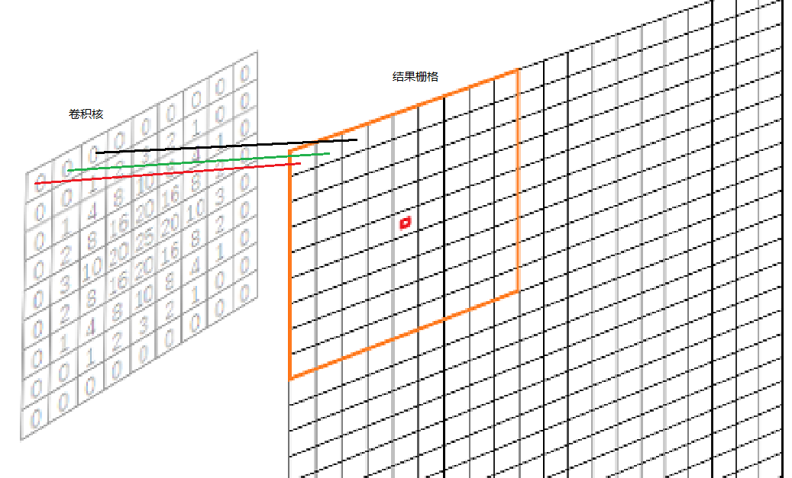

# 该过程文档的补充说明

> 基本代码架构（重建）

```scala
import geotrellis.raster._
import geotrellis.vector._
import scala.util._
import geotrellis.raster.mapalgebra.focal.Kernel

// 定义 geoPoint
object Points {
    // 这个是整个边界的范围
    val extent = Extent(-109, 37, -102, 41) // Extent of Colorado
	// 产生一个随机点的方法
    private def randInRange (low: Double, high: Double): Double = ...
	// 用来获取一系列点
	def getPts: List[PointFeature[Double]] = ...
};

object Main {
	def main(args: Array[String]): Unit = {
		// 主程序
		// 1.获取点和边界范围
		val pts = Points getPts;
    	val extent = Points extent;
		// 创建一个卷积核
		val kern: Kernel = Kernel.gaussian(9, 1.5, 25)
    	val kde: Tile = pts kernelDensity(kern, RasterExtent(extent, 700, 400))
	}
}
```

> ```RasterExtent(extent, 700, 400)```

- 1. 这里的 ```extent``` 是一个地图坐标表示，表示地图上一个区域的左上角到右下角的矩形范围

- 2. ```RasterExtent``` 相当于指定了地图的一个区域，并指定该区域使用 ```700*400``` 个像素进行填充，可以理解为有比例尺的一种情形。

> ```val kern: Kernel = Kernel.gaussian(kernelWidth, 1.5, 25)```





```scala
def testGaussion = {
	var size = 5;
	var sigma = 1.5;
	var amp = 25;
	val output = IntArrayTile.empty(size, size)

	val denom = 2.0*sigma*sigma

	var r = 0
	var c = 0
	while(r < size) {
		c = 0
		while(c < size) {
			val rsqr = (c - (size / 2)) * (c - (size / 2)) + (r - (size / 2)) * (r - (size / 2))
			val g = (amp * (math.exp(-rsqr / denom))).toInt
			output.set(c, r, g)
			c += 1
			print(g + "\t");
		}
		r += 1
		println();
	}
}

// size = 9 时，结果如下
// 0	0	0	0	0	0	0	0	0	
// 0	0	1	2	3	2	1	0	0	
// 0	1	4	8	10	8	4	1	0	
// 0	2	8	16	20	16	8	2	0	
// 0	3	10	20	25	20	10	3	0	
// 0	2	8	16	20	16	8	2	0	
// 0	1	4	8	10	8	4	1	0	
// 0	0	1	2	3	2	1	0	0	
// 0	0	0	0	0	0	0	0	0	
```

> ```val kde: Tile = pts kernelDensity(kern, RasterExtent(extent, 700, 400))```

- 这里的 pts 是一个 ```List[PointFeature[Double]]``` 对象，在源码中进行了隐式方法定义

- ```implicits.scala``` 定义隐式方法，并且指定方法来自 ```DoubleKernelDensityMethods.scala```

- ```DoubleKernelDensityMethods.scala``` 实现隐式方法内容，但是内容定义在 ```KernelDensity.scala```

- ```KernelDensity.scala``` 定义 ```Int``` 和 ```Double``` 类型的方法，调用了最后一个

- 图中是截取内容，可能不是全部内容，可以见左边的行号



- 下面是核心算法



> 计算方法核过程如下



- 1. 定义一个 ```栅格``` 并用其大小定义若干个在栅格中的**带值的点** ```pts```（对应代码）

- 2. 定义一个```卷积核```(看图)

- 3. 遍历每个点（图中每个红色的点），将 ```卷积核``` 和 ```栅格``` 对应上，```栅格``` 上每个点的值为，```红色点的值 * 对应卷积核上的值 + 栅格上的值``` 

- 4. 栅格上的值默认为 0

- 5. 点不是定义后就在栅格上的，计算时红色的点是**点上带的值**

- 完整代码

```scala
import geotrellis.raster._
import geotrellis.vector._
import scala.util._
import geotrellis.raster.mapalgebra.focal.Kernel
import geotrellis.raster.render._
import geotrellis.spark.tiling._
import geotrellis.spark.stitch.TileLayoutStitcher

object Points {
  // 这个是整个边界的范围
  val extent = Extent(-109, 37, -102, 41) // Extent of Colorado
  private def randInRange (low: Double, high: Double): Double = {
    val x = Random.nextDouble
    low * (1-x) + high * x
  }
  // 产生一个随机点的方法
  private def randomPointFeature(extent: Extent): PointFeature[Double] = {
    Feature(Point(randInRange(extent.xmin, extent.xmax),      // the geometry
      randInRange(extent.ymin, extent.ymax)),
      Random.nextInt % 16 + 16)                         // the weight (attribute)
  }
  // 用来获取一系列点
  def getPts: List[PointFeature[Double]] = {
    (for (i <- 1 to 1000) yield randomPointFeature(extent)).toList;
  }
};

object Main {
  def main(args: Array[String]): Unit = {
    val pts = Points getPts;
    val extent = Points extent;
    val kernelWidth: Int = 9
    /**
      * Gaussian kernel with std. deviation 1.5, amplitude 25
      * 核卷积要求必须是方形的，且必须为奇数，例如 1*1,3*3,5*5
      */
    val kern: Kernel = Kernel.gaussian(kernelWidth, 1.5, 25)
    val kde: Tile = pts kernelDensity(kern, RasterExtent(extent, 700, 400))
    val colorMap = ColorMap(
      (0 to kde.findMinMax._2 by 4).toArray,
      ColorRamps.HeatmapBlueToYellowToRedSpectrum
    )

    kde.renderPng(colorMap).write("test.png")
  }
}
```

- 以下是分段计算（不是 spark 分布式计算）

```scala
import geotrellis.raster._
import geotrellis.vector._
import scala.util._
import geotrellis.raster.mapalgebra.focal.Kernel
import geotrellis.raster.render._
import geotrellis.spark.tiling._
import geotrellis.spark.stitch.TileLayoutStitcher
import geotrellis.spark._

object Points {
  // 这个是整个边界的范围
  val extent = Extent(-109, 37, -102, 41) // Extent of Colorado
  private def randInRange (low: Double, high: Double): Double = {
    val x = Random.nextDouble
    low * (1-x) + high * x
  }
  // 产生一个随机点的方法
  private def randomPointFeature(extent: Extent): PointFeature[Double] = {
    Feature(Point(randInRange(extent.xmin, extent.xmax),      // the geometry
      randInRange(extent.ymin, extent.ymax)),
      Random.nextInt % 16 + 16)                         // the weight (attribute)
  }
  // 用来获取一系列点
  def getPts: List[PointFeature[Double]] = {
    (for (i <- 1 to 1000) yield randomPointFeature(extent)).toList;
  }
};

object Main {
  def main(args: Array[String]): Unit = {
    val pts = Points getPts;
    val extent = Points extent;
    val kernelWidth: Int = 9

    val tl = TileLayout(7, 4, 100, 100)
    val ld = LayoutDefinition(extent, tl)
    def pointFeatureToExtent[D](kwidth: Double, ld: LayoutDefinition, ptf: PointFeature[D]): Extent = {
      val p = ptf.geom

      Extent(p.x - kwidth * ld.cellwidth / 2,
        p.y - kwidth * ld.cellheight / 2,
        p.x + kwidth * ld.cellwidth / 2,
        p.y + kwidth * ld.cellheight / 2)
    }

    def ptfToExtent[D](p: PointFeature[D]) = pointFeatureToExtent(kernelWidth, ld, p)

    def ptfToSpatialKey[D](ptf: PointFeature[D]): Seq[(SpatialKey,PointFeature[D])] = {
      val ptextent = ptfToExtent(ptf)
      val gridBounds = ld.mapTransform(ptextent)

      for {
        (c, r) <- gridBounds.coords
        if r < tl.totalRows
        if c < tl.totalCols
      } yield (SpatialKey(c,r), ptf)
    }

    val keyfeatures: Map[SpatialKey, List[PointFeature[Double]]] =
      pts
        .flatMap(ptfToSpatialKey)
        .groupBy(_._1)
        .map {
          case (sk, v) => (sk, v.unzip._2)
        }

    val keytiles = keyfeatures.map { case (sk, pfs) =>
      (sk, pfs.kernelDensity(
        kern,
        RasterExtent(ld.mapTransform(sk), tl.tileDimensions._1, tl.tileDimensions._2)
      ))
    }
    val tileList =
      for {
        r <- 0 until ld.layoutRows
        c <- 0 until ld.layoutCols
      } yield {
        val k = SpatialKey(c,r)
        (k, keytiles.getOrElse(k, IntArrayTile.empty(tl.tileCols, tl.tileRows)))
      }

    val stitched = TileLayoutStitcher.stitch(tileList)._1

    stitched.renderPng(colorMap).write("test1.png")
  }
}
```