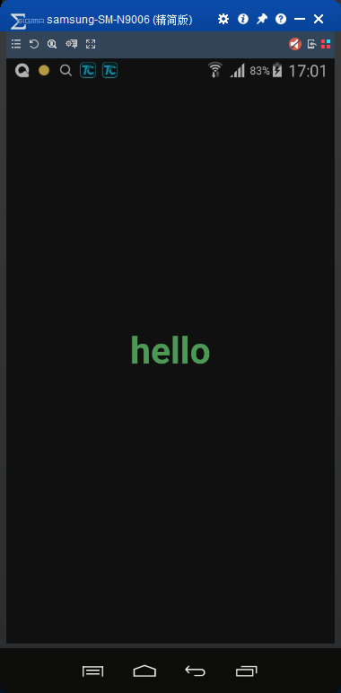
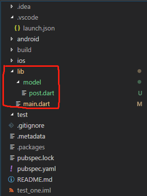
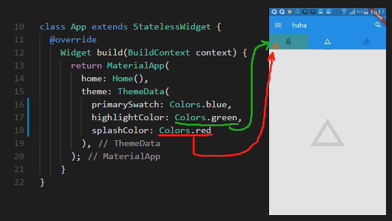
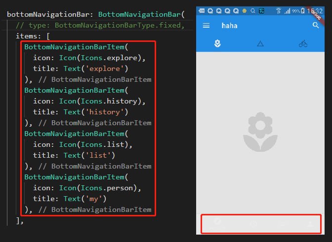
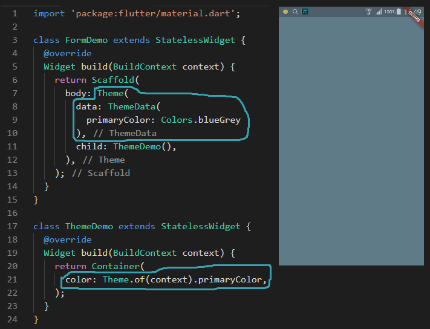

# 基础入门

## 问题

> 1. flutter 调试无效问题

>> 在使用下面的第一个例子时，发现无法进行热更新，我的猜测是 runApp 中直接编写代码，修改无法进行替换的问题。即 void main 在程序中为特定节点，更新时不进行替换，然后再将 runApp 中的内容修改指定函数时，指定函数修改可以被替换，因此可以进行热更新。

> 2. 数据问题(形如下面代码)

```log
Error: The argument type 'int/*1*/' can't be assigned to the parameter type
```

>> 没有找到为什么会发生以下错误，我通过删除 build 文件夹，重新跑项目将该问题解决，不清楚问题的本质是什么，可能是累积错误太多，导致误报。

> 3. 图片跨域和图片不存在问题

```log
(OS Error: No address associated with hostname, errno = 7)
```

>> 这类问题可能是定义了图片展示，但是无法看到效果，这类问题只要多看 log 就可以解决。

> 4. 发现非 main.dart 文件无法进行热部署

>> 编写修改 /lib/model/post.dart 文件时，发现文件修改不会通过热部署渲染在页面上。

---

> 1. 简单例子

```dart
import 'package:flutter/material.dart';

void main() {
    runApp(
        Center(
        child: Text(
          'hello',
          textDirection: TextDirection.ltr,
          style: TextStyle(
            fontSize: 40.0,
            fontWeight: FontWeight.bold,
            color: Colors.green
          )
        ),
      );
    );
}
```

> 2. 拆成部件进行编写

```dart
import 'package:flutter/material.dart';

void main() {
  runApp(
    Hello()
  );
}

class Hello extends StatelessWidget {
  @override
    Widget build(BuildContext context) {
      // TODO: implement build
      return Center(
        child: Text(
          'hello',
          textDirection: TextDirection.ltr,
          style: TextStyle(
            fontSize: 40.0,
            fontWeight: FontWeight.bold,
            color: Colors.green
          )
        ),
      );
    }
}
```



> 3. 更多内容

```dart
class App extends StatelessWidget {
  @override
    Widget build(BuildContext context) {
      // TODO: implement build
      return MaterialApp(
        home: Scaffold(
          appBar: AppBar(
            title: Text("NIHAO"),
            elevation: 0.0,
          ),
          body: Hello(),
        ),
        theme: ThemeData(
          primarySwatch: Colors.yellow
        ),
      );
    }
}

class Hello extends StatelessWidget {
  @override
    Widget build(BuildContext context) {
      // TODO: implement build
      return Center(
        child: Text(
          'hello',
          textDirection: TextDirection.ltr,
          style: TextStyle(
            fontSize: 40.0,
            fontWeight: FontWeight.bold,
            color: Colors.yellow
          )
        ),
      );
    }
}
```

> 4. 编写一个列表

- lib/main.dart

```dart
import 'package:flutter/material.dart';
import 'package:test_one/model/post.dart';

void main() {
  runApp(
    App()
  );
}

class App extends StatelessWidget {
  @override
    Widget build(BuildContext context) {
      return MaterialApp(
        home: Home(),
        theme: ThemeData(
          primarySwatch: Colors.blue
        ),
      );
    }
}

class Home extends StatelessWidget {
  Widget _listItemBuilder(BuildContext context,int index) {
    print('[index]:' + index.toString());
    var img = new Image.network(posts[index].imageUrl);

    return Container(
      color: Colors.white,
      margin: EdgeInsets.all(8.0),
      child: Column(
        children: <Widget>[
          img,
          SizedBox(height: 16.0),
          Text(
            posts[index].title,
            style: Theme.of(context).textTheme.title,
          ),
          Text(
            posts[index].author,
            style: Theme.of(context).textTheme.subhead,
          ),
          SizedBox(height: 16.0)
        ],
      ),
    );
  }

  @override
    Widget build(BuildContext context) {
      return Scaffold(
        backgroundColor: Colors.grey[100],
        appBar: AppBar(
          title: Text('haha'),
          elevation: 0.0,
        ),
        body: ListView.builder(
          itemCount: posts.length,
          itemBuilder: _listItemBuilder,
        ),
      );
    }
}
```

- lib/model/post.dart

```dart
class Post {
  const Post({
    this.title,
    this.author,
    this.imageUrl
  });

  final String title;
  final String author;
  final String imageUrl;
}

// 图片是直接复制 百度图片的图片的链接，可能会存在失效的问题
final List<Post> posts = [
  Post(
    title: 'Candy Shop',
    author: 'Mohamed Chahin',
    imageUrl: 'https://ss1.bdstatic.com/70cFuXSh_Q1YnxGkpoWK1HF6hhy/it/u=3735008710,1033072259&fm=27&gp=0.jpg',
  ),
  Post(
    title: 'Candy Shop',
    author: 'Mohamed Chahin',
    imageUrl: 'https://ss1.bdstatic.com/70cFvXSh_Q1YnxGkpoWK1HF6hhy/it/u=2088206210,2085020975&fm=27&gp=0.jpg',
  )
];
```




> 5. 主题设置

```dart
void main() {
  runApp(
    App()
  );
}

class App extends StatelessWidget {
  @override
    Widget build(BuildContext context) {
      // 返回一个主题配置
      return MaterialApp(
        home: Home(),
        // 主题设置
        theme: ThemeData(
          // 主要颜色
          primarySwatch: Colors.blue,
          // 高亮部分颜色
          highlightColor: Color.fromRGBO(255, 255, 255, 0.5),
          // 水波纹颜色
          splashColor: Colors.white70
        ),
      );
    }
}
```



> - 6. bottomNavigationBar 在按钮多于 3 个时会自动变成另一种类型



> 修改类型即可

```dart
bottomNavigationBar: BottomNavigationBar(
  // 添加这句话
  type: BottomNavigationBarType.fixed,
  items: [
    BottomNavigationBarItem(
      icon: Icon(Icons.explore),
      title: Text('explore')
    ),
    BottomNavigationBarItem(
      icon: Icon(Icons.history),
      title: Text('history')
    ),
    BottomNavigationBarItem(
      icon: Icon(Icons.list),
      title: Text('list')
    ),
    BottomNavigationBarItem(
      icon: Icon(Icons.person),
      title: Text('my')
    ),
  ],
),
```

> - 7. 主题

- 主题配置后，相关的内容可以在任意地方被使用 


- 如果需要改写，可以使用以下方法



- 但是这样会重写主题，可以使用复制方法

```dart
// Theme.of(context).copyWith( 样式内容 )
class FormDemo extends StatelessWidget {
  @override
  Widget build(BuildContext context) {
    return Scaffold(
      body: Theme(
        data: Theme.of(context).copyWith(
          primaryColor: Colors.blueGrey
        ),
        child: ThemeDemo(),
      ),
    );
  }
}

class ThemeDemo extends StatelessWidget {
  @override
  Widget build(BuildContext context) {
    return Container(
      color: Theme.of(context).primaryColor,
    );
  }
}
```

> - 8. Navigator

- Navigator 是负责整个 APP 的页面导航的，类似 HTML 的 history

- 最重要的 push 和 pop 方法

- push 方法说明

>> **打开页面**

```dart
// 该方法是打开一个新的页面
Navigator.of(context).push(
  // page 是一个组件
  MaterialPageRoute(builder: (context) => page)
);

//或者在 APP 开始处定义，使用路由打开页面
MaterialApp(
  // home: NavigatorDemo(),
  // 这里定义默认启动路由
  initialRoute: '/mdc',
  routes: {
    // Home,Page,FormDemo,MaterialComponent 都是组件
    '/': (context) => Home(),
    '/about': (context) => Page(),
    '/form': (context) => FormDemo(),
    '/mdc': (context) => MaterialComponent()
  },
  theme: ThemeData(
    primarySwatch: Colors.blue,
    highlightColor: Colors.green,
    splashColor: Colors.red,
    accentColor: Color.fromRGBO(3, 54, 255, 1.0)
  ),
);
Navigator.pushNamed(context, '/form');
```

- pop 方法说明

>> **异步**　　**退出组件**

```dart
// 该方法可以用于退出某一个页面或者一个弹窗，pop 的第二个参数用于最为一个组件的返回内容，注意到这里需要是异步操作，因为不知道组件什么时候会退出
//基本用法 Navigator.pop(context,'A');

import 'dart:async';
// Future 表示该方法会异步放回内容，内容为 void 型
// 方法需要定义 async
// 并且内容有 await 关键字
Future<void> _openModalBottomSheet() async {
    final option = await showModalBottomSheet(
      context: context,
      builder: (BuildContext context) {
        return Container(
          height: 200.0,
          child: Column(
            children: <Widget>[
              ListTile(
                title: Text('Option A'),
                onTap: () {
                  // 这里是关闭 showModalBottomSheet 的弹窗并将 A 作为该弹窗的返回值
                  Navigator.pop(context,'A');
                },
              ),
              ListTile(
                title: Text('Option B'),
                onTap: () {
                  // 这里是关闭 showModalBottomSheet 的弹窗并将 B 作为该弹窗的返回值
                  Navigator.pop(context,'B');
                },
              ),
            ],
          ),
        );
      }
    );
    // 这里是等待 showModalBottomSheet 退出后才执行的
    debugPrint(option);
```

> - 9 状态管理

>> 父组件定义必须为 StatefulWidget 组件类型

>> 简单的组件状态继承(缺点是继承的链上有部分组件不需要这些数据，但是作为继承链上一个点必须承担继承的任务)

```dart
// 定义一个 StatefulWidget 父组件
class StateManagementDemo extends StatefulWidget {
  @override
  _StateManagementDemoState createState() => _StateManagementDemoState();
}

class _StateManagementDemoState extends State<StateManagementDemo> {
  int _count = 0;

  void _increaseCount() {
    setState(() {
      _count += 1; 
    });
  }

  @override
  Widget build(BuildContext context) {
    return Child(_count,_increaseCount);
  }
}

class Child extends StatelessWidget {
  final int _count;
  // 父组件的方法
  final VoidCallback increaseCount;
  Child({
    this._count;
    this.increaseCount;
  });
  @override
  Widget build(BuildContext context) {
    return ActionChip(
      label: Text('$_count'),
      onPressed: increaseCount,
    );
  }
}
```

>> 使用 InheritedWidget 解决

```dart
// 定义一个状态管理类
class CounterProvider extends InheritedWidget {
  final int count;
  final VoidCallback increaseCount;
  final Widget child;

  CounterProvider({
    this.count,
    this.increaseCount,
    this.child
  }) :super(child:child);

  // 让属性通过 . 方法进行暴露
  static CounterProvider of(BuildContext context) => context.inheritFromWidgetOfExactType(CounterProvider);

  // 返回 true 表示通知所有调用该类的组件进行更新
  @override
  bool updateShouldNotify(InheritedWidget oldWidget) {
    // TODO: implement updateShouldNotify
    return true;
  }
}

class StateManagementDemo extends StatefulWidget {
  @override
  _StateManagementDemoState createState() => _StateManagementDemoState();
}

class _StateManagementDemoState extends State<StateManagementDemo> {
  int _count = 0;

  void _increaseCount() {
    setState(() {
      _count += 1; 
    });
  }

  @override
  Widget build(BuildContext context) {
    return CounterProvider(
      count: _count,
      increaseCount: _increaseCount,
      child: Child(_count,_increaseCount)
    );
  }
}

class Child extends StatelessWidget {
  @override
  Widget build(BuildContext context) {
    final int _count = CounterProvider.of(context).count;
    final VoidCallback increaseCount = CounterProvider.of(context).increaseCount;
    return ActionChip(
      label: Text('$_count'),
      onPressed: increaseCount,
    );
  }
}
```

> - 使用 scoped_model（父组件可以使用 StatelessWidget 定义）

> - 使用到 数据部分 需要使用 ScopedModelDescendant<CounterModel> 进行定义，并用 builder 方法创建组件，其中 builder 的 model 参数就是定义的参数

```dart
// 定义一个 model
class CounterModel extends Model {
  int _count = 0;
  int get count => _count;

  void increaseCount() {
    _count += 1;
    notifyListeners();
  }
}

class Parent extends StatelessWidget {
  @override
  Widget build(BuildContext context) {
    return Child
  }
}

class Child extends StatelessWidget {
  @override
  Widget build(BuildContext context) {
    return ScopedModelDescendant<CounterModel>(
      builder: (Context,_,model) => ActionChip(
        label: Text('${model.count}'),
        onPressed: model.increaseCount,
      ),
    );
  }
}
```

> - Stream (数据流)

>> StreamController 定义一个 Stream 的控制器

>> StreamSink 定义 StreamControll 的方法

>> StreamSubscription 定义 Stream 的控制对象

```dart
class _StateManagementDemoState extends State<StateManagementDemo> {
  StreamSubscription _streamSubscription;
  StreamController<String> _streamControllerDemo;
  StreamSink _sinkDemo;

  @override
  void dispose() {
    // 组件销毁时销毁控制器
    _streamControllerDemo.close();
    super.dispose();
  }
  
  @override
  void initState() {
    super.initState();

    _streamControllerDemo = StreamController<String>();
    _sinkDemo = _streamControllerDemo.sink;

    // 分别监听
    // onData : 有数据时的响应
    // onError : 发生错误时响应
    // onDone : Stream 处理结束时响应
    // _streamSubscription 有 pause\resume\cancel 等控制 Stream 的方法
    _streamSubscription = 
      _streamControllerDemo
        .stream
        .listen(onData,onError: onError,onDone: onDone);

    addDataToStream();
  }

  Future<String> fetchData() async {
    await Future.delayed(Duration(seconds: 2));
    return 'Hello ~';
    // throw 'Something error';
  }

  void addDataToStream() async {
    // 这一步类似于网络请求延时
    String data = await fetchData();
    // 将数据添加到 Stream 中
    _sinkDemo.add(data);
  }

  @override
  Widget build(BuildContext context) {
    return Container();
  }
}
```

>> StreamController 可以定义为有多个监听

```dart
_streamControllerDemo = StreamController.broadcast();
_streamControllerDemo
        .stream
        .listen(
          onDataOne,
          onError: onErrorOne,
          onDone: onDoneOne);
_streamControllerDemo
        .stream
        .listen(
          onDataTwo,
          onError: onErrorTwo,
          onDone: onDoneTwo);
```

>> 使用 StreamBuilder 构建数据变化时的组件

```dart
Widget build(BuildContext context) {
  return Container(
    child: StreamBuilder(
      // 指定使用哪个 stream
      stream: _streamControllerDemo.stream,
      // 刚开始没有数据时的数据
      initialData: '...',
      // 构建方法，snapshot 是当前 stream 的内容
      builder: (context,snapshot) {
        return Text('${snapshot.data}');
      },
    )
  );
}
```

> - Observable 本质上是一个继承 Stream 的类

>> 需要使用到 rxdart ，是一个扩展

```dart
import 'package:rxdart/rxdart.dart';
import 'dart:async';

Observable<String> _observable =
  // 从 Stream 产生数据
  // Observable(Stream.fromIterable(['hello','你好']));
  // Observable(Stream.fromFuture(Future.value('hello ~')));
  // 从一个可以迭代的数据产生
  // Observable.fromIterable(['hello']);
  // 直接返回数据
  // Observable.just('hello');
  // 每隔一段时间产生一个数据
  Observable.periodic(Duration(seconds: 3),(x) => x.toString());

_observable.listen(print);
```

> - PublishSubject 相当于 StreamController

> - BehaviorSubject 和 PublishSubject 用法一致，区别是可以先定义监听再添加数据

> - ReplaySubject 和 BehaviorSubject 用法一致，区别是可以设置接收内容个数

```dart
PublishSubject<String> _subject =PublishSubject<String>();
// BehaviorSubject<String> _subject =BehaviorSubject<String>();

//ReplaySubject<String> _subject =ReplaySubject<String>(maxSize: 2);

_subject.add('hi');
_subject.listen((data) => print('listen 1: $data'));
_subject.add('hello');
_subject.listen((data) => print('listen 2: ${data.toUpperCase()}'));
_subject.add('hello ibas');

_subject.close();

// PublishSubject 输出内容为
// listen 1: hello
// listen 2: HELLO IBAS
// listen 1: hello ibas

// BehaviorSubject 输出内容为
// listen 1: hi
// listen 2: HI
// listen 1: hello
// listen 2: HELLO
// listen 2: HELLO IBAS
// listen 1: hello ibas

// BehaviorSubject 输出内容为(只有 _subject.add 都在 listen 前面才有效)
// listen 1: hi
// listen 1: hello
// listen 2: HI
// listen 1: hello ibas
// listen 2: HELLO
// listen 2: HELLO IBAS
```

>> 以上类都有以下方法

| 方法 | 说明 |
| -- | -- |
| debounce | 设定每隔一段时间再响应 |
| where | 筛选 |
| map | map |
| listen | 监听 |

```dart
class RxDartHome extends StatefulWidget {
  _RxDartHomeState createState() => _RxDartHomeState();
}

class _RxDartHomeState extends State<RxDartHome> {
  PublishSubject<String> _textFieldSubject;

  @override
  void initState() {
    // TODO: implement initState
    super.initState();

    _textFieldSubject =PublishSubject<String>();

    _textFieldSubject
      // 这里可以假定是当 输入框 内容修改时，向服务器请求，但是又不想一输入就请求，设定输入结束 500ms 后再请求
      .debounce(Duration(milliseconds: 500))
      // 这里假定要长度大于 8 再进行处理
      .where((item) => item.length > 8)
      // 这里假定将输入进行修改
      .map((item) => 'item: $item')
      // 这里时数据处理
      .listen((data) => print('$data'));
  }

  @override
  void dispose() {
    _textFieldSubject.close();
    super.dispose();
  }

  @override
  Widget build(BuildContext context) {
    return Theme(
      data: Theme.of(context).copyWith(
        primaryColor: Colors.black
      ),
      child: TextField(
        onChanged: (value) {
          _textFieldSubject.add('input $value');
        },
        decoration: InputDecoration(
          labelText: 'Name',
          filled: true
        ),
      ),
    );
  }
}
```

> - 10 . 类定义

```dart
// 定义一个类
class Post {
  final String title;
  final String description;

  Post(
    this.title,
    this.description
  );

  Post.fromJson(Map json)
    : title =json['title'],
      description = json['description'];
}

// 使用该类
// 常见方法
final post_1 = Post(
  title: '',
  description: ''
);
// 使用 fromJson 方法
final post_2 = Post.fromJson({
  title: '',
  description: ''
});

```

