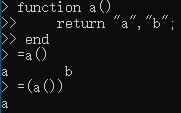

一、取整


```lua
a = math.pi;
= a - a%0.01
```

二、求字符串长度


```lua
a="ibas"
=#a
```

三、拼接字符串


```lua
a = "Hello";
= a .. "  " .. "world" .. "  " .. 123
```

四、多行字符串

但需要用到 [[ 或 ]] 可以利用 [(+任意多个等号)[ 和 ](+同样数量任意多个等号)]

```lua
a = [[
    first
    second
]]
b = [====[
    ibas=a[b[0]]
    [[hahahaha]]
]====]
```

五、仅获取函数的一个返回值


```lua
function a()
    return "a","b";
end
=a()
=(a())
```

六、goto转移

```lua
a = 1;
::add::
a = a + 1;
if a < 5 then
    goto add
end
print(a);
```

七、通过命令行的重定向读取文件


```lua
for line in io.lines() do
	print(line);
end
```

```cmd
lua luafile.lua < file
```
