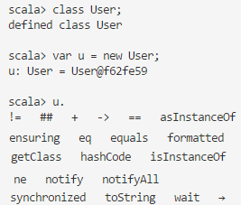
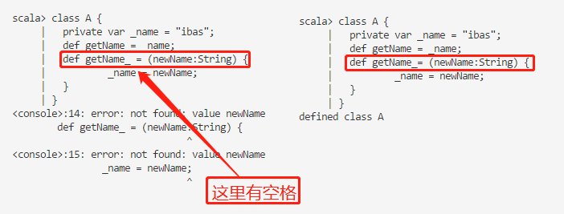

# 类

- 类定义可以没有内容

```scala
class User;
var u = new User;
```



- 类构造器

```scala
// 构造器可以定义默认值
class Point(var x:Int = 0,var y:Int = 0);
println(new Point(1,1).x);
```

- 私有变量和 ```Getter``` 与 ```Setter```

- def x = _x 是 ```getter``` 方法

- scala 中规定 ```setter``` 方法是 ```getter``` 方法后方加 ```_```

- **特别强调** def getter_= () = {} 等号前不能有空格



```scala
class Point {
  private var _x = 0
  private var _y = 0
  private var bound = 100

  def x = _x
  def x_= (newValue: Int): Unit = {
    if (newValue < bound) _x = newValue else printWarning
  }

  def y = _y
  def y_= (newValue: Int): Unit = {
    if (newValue < bound) _y = newValue else printWarning
  }

  def boundGetter = bound
  def boundGetter_= (newValue: Int) = {
      bound = newValue;
  }

  private def printWarning = println("WARNING: Out of bounds")
}

val point1 = new Point
point1.x = 99
point1.y = 101 // prints the warning
point1.boundGetter = 121
point1.y = 101
```

- 构造函数如果不带 ```val``` 或 ```var```，则变量是私有的，如果带有则为共有，但是 ```val``` 是不可变的

```scala
class Point(x: Int,var y: Int,val z: Int);
var a = new Point(1,2,3);
println(a.x) // error: value x is not a member of Point
println(a.y)
println(a.z)
a.y = 2 
a.z = 3 // error: reassignment to val
```
