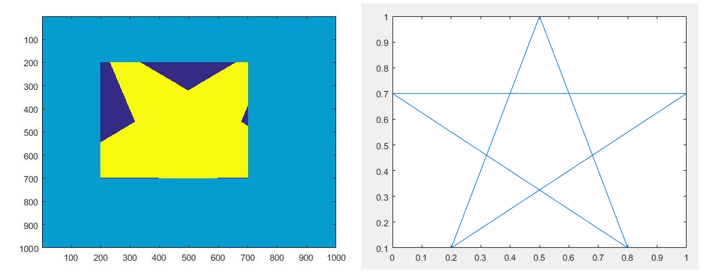
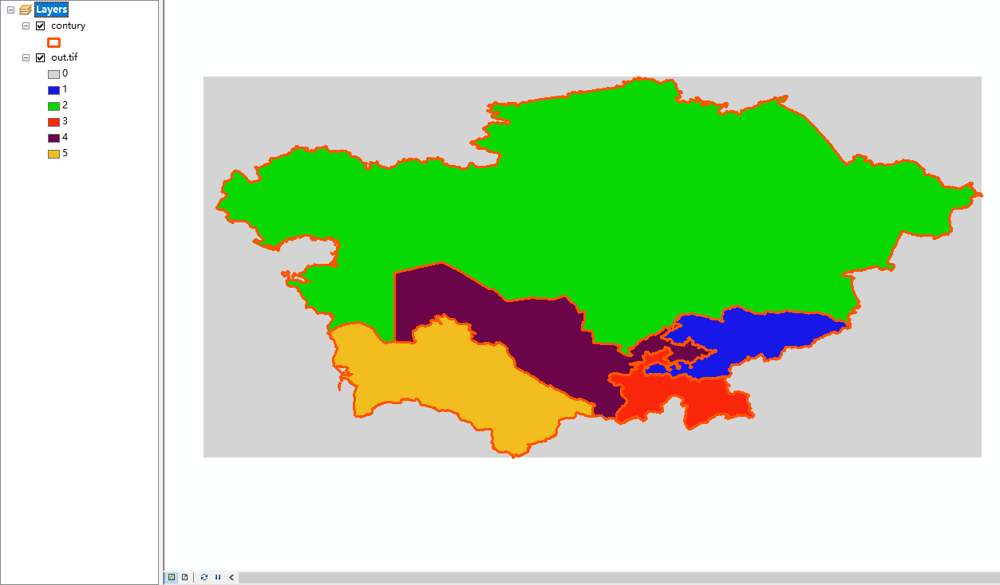

# 常用代码记录

> 根据一个边界和一个子空间，将空间内的内容选中

- 1.边界时一个五角星

- 2.子空间是 [0:1000,0:1000] 中的 [200:700,200:700] 区域

- 3.将子空间内和五角星相交🍌部分定义为黄色，另外定义为蓝色

- 4.将修改的子空间并回原本的空间中



```matlab
% 五角星
xv = [0.5;0.2;1.0;0;0.8;0.5];
yv = [1.0;0.1;0.7;0.7;0.1;1];

img = ones(1000,1000);

x = [200:1:700];
y = [200:1:700];
[tx,ty] = meshgrid(x,y);
xx = tx * 0.001 + 0.003;
yy = ty * 0.001 + 0.004;

[in,on] = inpolygon(xx,yy,xv,yv);

img(y,x) = in * 3;
imagesc(img);
```

- [实例]将矢量对应到栅格上的部分填充为一种颜色



```matlab
tifPath = 'result-2019-8.tif';
outTifPath = 'out.tif';
[img,R] = geotiffread(tifPath);
img = rot90(img,3);
tmp = img;
tmp(:,:) = 0;
[img_x,img_y] = size(img);

shpPath = 'contury.shp';
% shp 文件读入
S=shaperead(shpPath);
SInfo = {};
% xy 初始位置及偏移
x = R.LongitudeLimits(1);
dx = R.CellExtentInLongitude;
y = R.LatitudeLimits(1);
dy = R.CellExtentInLatitude;
%像素点大小
pix = 1000 * 1000;
% 获取shp的每个区域的 extent
for ii = 1:numel(S)
    b = S(ii).BoundingBox;
    b(:,1) = (b(:,1) - x) / dx;
    b(:,2) = (b(:,2) - y) / dy;
    b = int16(b);
    b(1,:) = b(1,:) - 1;
    b(1,:) = max(b(1,:),1);
    b(2,1) = min(b(2,1),img_x);
    b(2,2) = min(b(2,2),img_y);
    
    xr = b(1,1) : b(2,1);
    yr = b(1,2) : b(2,2);
    [tx,ty] = meshgrid(xr,yr);
    xx = double(tx) * dx + x;
    yy = double(ty) * dy + y;
    
    [in,on] = inpolygon(xx,yy,S(ii).X,S(ii).Y);
    in = in * ii;
    tmp(xr,yr) = tmp(xr,yr) + int16(in');
end
geotiffwrite(outTifPath,rot90(tmp,1),R);
```